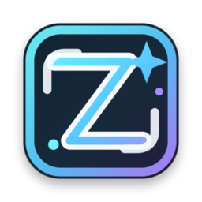
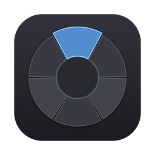

<div align="center">


&nbsp;&nbsp;&nbsp;&nbsp;


# 幻梦AI · Dream AI

**在 Photoshop 里做 AI 修图的一套工具** ——
一个常驻面板负责干活，一个画布上的圆环菜单负责「不离开画布也能操作」。

[](LICENSE)


</div>

---

<!-- 建议在这里放 2–3 张实际操作截图（面板 / 圆环展开 / 生成结果）。
     截图比任何文字都管用，但仓库里目前还没有，需要你自己截。 -->

## 目录

- [这是什么](#这是什么)
- [功能](#功能)
- [为什么圆环是原生应用](#为什么圆环是原生应用)
- [安装](#安装)
- [快速上手](#快速上手)
- [项目结构](#项目结构)
- [从源码构建](#从源码构建)
- [测试](#测试)
- [常见问题](#常见问题)
- [许可证](#许可证)

---

## 这是什么

两个可以独立使用、也可以配合使用的产品：

|  | **幻梦AI 修图插件** | **幻梦圆环** |
|---|---|---|
| 是什么 | Photoshop UXP 面板 | macOS 菜单栏里的圆环菜单 |
| 长什么样 | 常驻在面板区 | 按快捷键后浮在画布上，选完即走 |
| 平台 | macOS / Windows（UXP 跨平台） | macOS 13+（Windows 版在 `win/`，尚未编译验证） |
| 版本 | `3.1.1` | `0.1.0` |
| 干什么 | 生成、读选区、校色、回写文档、工具箱 | 唤出菜单，把命令发给插件 |

**只装插件就能正常干活**，面板里什么都有。
装上圆环之后多一种用法：手不离画布，`⌥⌘R` 唤出菜单直接选参数、套预设、读选区、生成。

圆环不连接插件时**也能独立出图**（用助手自己的配置和预设），相当于一个轻量的生图小工具。

---

## 功能

### 幻梦AI 修图插件

- **多渠道**：GRS、火山方舟、xAI、grok2api、Sub2API、New API、Firefly、Google AI Studio、RunningHub
  —— 填自己的密钥，插件只做转发与统一
- **文生图 / 以图生图**，支持参考图与选区
- **读 Photoshop 选区** → 生成 → 自动校色 → 写回当前文档（在 `executeAsModal` 里串行执行）
- **生成中心**：任务队列、进度、失败重试、生成记录
- **生成画廊**：本地存储，缩略图浏览、导出
- **提示词预设**：分类管理，可版本化、可另存
- **工具箱**：辉光、粒子 VFX、示波器、配色校准、画布工具
- **两种形态**：既能当 UXP 插件，也能当 **H5 / PWA** 用（手机浏览器可「添加到主屏幕」）

### 幻梦圆环

- `⌥⌘R` 或 **PS 里 `⌥` + 右键** 唤出，在鼠标位置弹出
- 六个扇区：**生成 / 参数 / 预设 / 对话 / 读选区 / 关闭**
- 参数菜单**直接镜像主插件的下拉控件** —— 圆环上看到的和面板里永远是同一份数据
- 多级菜单：悬停高亮、点击进入、`1`–`9` 直选、`Esc` 关闭
- **外观全部可配置**：环大小、环带厚度、11 组配色、出现动画、悬停速度、扇区改名/排序/显隐
- 独立模式：自己的接口配置、预设库、聊天记录、截图与文件导入

---

## 为什么圆环是原生应用

不是「想用 Swift 写」，是 **UXP 根本做不到**。三条硬限制同时封死（均已实测确认）：

1. `entrypoints` 只有 `command` / `panel` 两种类型，**没有 `modal`**，写进去整个插件加载失败；UXP 也没有 `window.open`
2. 面板没有任何定位 / 无边框 / 置顶 API，**UI 无法超出面板边界**
3. **没有任何全局鼠标或键盘 API** —— Adobe 在开发者论坛明确确认：
   "the core UXP APIs don't support keyboard shortcuts"，按键只能在面板获得焦点时捕获

所以画布上的浮层必须由一个独立的原生进程来画。
Adobe 官方的 `desktop-helper-sample` 就是这个架构：**UXP 插件 + 外部进程 + WebSocket**。

```
幻梦圆环.app（Swift / AppKit）
   │  WebSocket 服务端 127.0.0.1:8799
   │  下发：生成 / 参数 / 预设 / 读选区 / 对话
   │  上报：state（文档、参数、选项、预设）  progress（进度、结果缩略图）
   ▼
幻梦AI 修图插件（UXP，WebSocket 客户端）
```

UXP 侧只有 WebSocket **客户端**、开不了监听端口（实测确认），所以服务端由助手来当。

---

## 安装

> **需要自备 API Key。** 本项目不含任何 AI 服务，插件只是一个界面 + 转发层，
> 密钥只存在你自己的机器上（插件用 `localStorage`，助手用 `~/.huanmeng-ring.json`）。

### 方式一：一键安装（macOS，推荐）

双击根目录的 **`一键安装.command`**。它会依次：

编译助手 → 安装到 `~/Applications` → 设置开机自启 → 引导辅助功能授权
→ 把插件加载进 Photoshop → 跑一次自检

需要 Xcode Command Line Tools：

```bash
xcode-select --install
```

### 方式二：只用插件（不需要圆环）

用 [Adobe UXP Developer Tool](https://developer.adobe.com/photoshop/uxp/2022/guides/devtool/)
把 `Dream-ps-ai/` 目录 **Add Plugin** 加载即可。Windows 上同样适用。

### 方式三：H5 / PWA

把 `Dream-ps-ai/` 目录整体放到支持 HTTPS 的静态站点上即可。
详见 [`Dream-ps-ai/H5-部署说明.md`](Dream-ps-ai/H5-部署说明.md)。

---

## 快速上手

1. 打开 Photoshop → 打开幻梦AI面板 → **设置** 里填入你的 API Key 和接口地址
2. 在面板里写提示词 → 生成
3. 想让结果落进文档：先框选或直接生成，插件会自动校色后写回当前图层

**用圆环**：

| 操作 | 效果 |
|---|---|
| `⌥⌘R` | 在鼠标位置唤出圆环 |
| PS 里 `⌥` + 右键 | 同样唤出（**只在 PS 前台时拦截**，普通右键完全不受影响） |
| 移动鼠标 | 高亮跟随，圆心显示当前项 |
| 左键点扇区 / 数字键 `1`–`9` | 选中执行 |
| 点带 `▸` 的扇区 | 进入下一级（悬停只高亮，不展开） |
| 点圆心 / `←` / `Delete` | 返回上一级 |
| `Esc` | 关闭整个圆环 |

参数的完整说明、排障流程看 **[`HuanmengRing/使用说明.md`](HuanmengRing/使用说明.md)** ——
里面有一个内置自检（菜单栏 ◎ →「自检…」），出问题它会直接告诉你哪儿不对。

---

## 项目结构

```text
Dream-ai/
├── Dream-ps-ai/             幻梦AI 修图插件（UXP / H5）
│   ├── index.html           面板入口：视图模板 + 内联样式
│   ├── manifest.json        Photoshop UXP 清单
│   ├── manifest.webmanifest H5 / PWA 清单
│   └── src/
│       ├── app/index.js     应用启动、任务与 Provider 编排
│       └── features/        按功能成套组织（服务 + 界面 + Host 适配）
│           ├── color-match/     图像校色
│           ├── gallery/         画廊存储
│           ├── glow/            多尺度辉光
│           ├── photoshop-core/  executeAsModal 串行队列
│           ├── reference-ui/    半合成提示词
│           ├── ring-bridge/     与圆环助手的 WebSocket 桥接
│           └── space-fx/        热浪 / 气流 / 刀光位移
│
├── HuanmengRing/            幻梦圆环（macOS 原生 + Windows 版）
│   ├── native/              Swift / AppKit，SPM 构建
│   ├── win/                 C# / WPF（只有桥接层，尚未编译验证）
│   ├── tests/               真机桥接测试
│   ├── 使用说明.md          从零到能用 + 排障
│   └── SPEC-ring-config.md  配置与桥接协议规格
│
├── Docs/                    README 用的图标
├── _archive/                已归档的早期版本，不维护
├── 一键安装.command          macOS 一键安装
└── LICENSE                  GPL-3.0
```

---

## 从源码构建

### 圆环（Swift）

```bash
cd HuanmengRing
bash native/build.sh run          # 构建并启动
bash native/build.sh              # 只构建 → native/build/HuanmengRing.app

bash native/package.sh            # 打包成 dist/幻梦圆环-<版本>.dmg
bash native/autostart.sh install  # 开机自启（可选）
```

有 Apple Developer ID 的话，打包时传入即可自动正式签名与公证：

```bash
SIGN_IDENTITY="Developer ID Application: XXX (TEAMID)" bash native/package.sh
```

没有也能分发，只是对方首次打开要在「隐私与安全性」里手动放行。

**Windows 版**目前只有桥接层（WebSocket 服务端、热键、输入钩子），
生成与 Grs 客户端尚未移植，见 [`HuanmengRing/win/README-win.md`](HuanmengRing/win/README-win.md)。

### 插件（JavaScript）

**没有构建步骤，不使用 ES Module。** `index.html` 按固定顺序用 `<script src>` 加载
`src/features/*`，最后加载 `src/app/index.js`，各 feature 通过 `window.<命名空间>` 暴露。
改完直接 Reload 即可。

---

## 测试

**插件**（Node，不需要 Photoshop）：

```bash
cd Dream-ps-ai
node --check src/app/index.js        # 其余源文件见 Dream-ps-ai/README.md

node tests/feature-services.test.js   # 校色 / 辉光 / 空间特效
node tests/gallery-store.test.js      # 画廊存储
node tests/grs-aspect.test.js         # 尺寸比与接口参数映射（41）
node tests/image-extract.test.js      # 各家响应里提取图片（10）
node tests/plugin-integrity.test.js   # manifest / 结构完整性（55）
node tests/ring-chat.test.js          # 圆环桥接的对话协议
```

**圆环**（需要 Photoshop + UXP Developer Tool 运行中、主插件已加载）：

```bash
cd HuanmengRing
native/HuanmengRing/.build/debug/HuanmengRing --selftest   # 图像提取自检，13 个用例
native/HuanmengRing/.build/debug/HuanmengRing --doctor     # 环境自检

node tests/main-plugin-bridge-test.mjs   # 桥接 + 状态快照
node tests/ring-reconnect-test.mjs       # 断线自动重连
```

---

## 常见问题

**圆环唤不出来？**
先看菜单栏的图标：`◎` 已连接、`○` 等待插件、`◐` 忙碌、`✕` 出错。
`⌥⌘R` 走 Carbon 热键，**不需要任何权限**；只有 `⌥`+右键 需要辅助功能授权。
菜单栏 ◎ →「自检…」会直接告诉你缺什么。

**辅助功能授权过几天又失效了？**
授权绑定的是**签名身份**。用 ad-hoc 签名（`codesign -s -`）时身份是二进制的 cdhash，
每次重新构建都会变 → 授权失效。跑一次 `bash HuanmengRing/native/make-signing-cert.sh`
生成自签名证书，以后重建就不会再掉授权。

**面板里显示「缺密钥」？**
那是如实反映 —— 只有你填过密钥的渠道才会显示为可用。

**生成报 400 / `The model load is too high`？**
服务端过载，不是代码问题，过一会儿重试。

**插件和圆环连不上？**
助手是 WebSocket **服务端**（`127.0.0.1:8799`），插件是客户端。
端口被占用时双方都连不上 —— 检查是不是开了两个助手实例。

---

## 贡献

Issue 和 PR 都欢迎。提交前请：

- 插件侧跑一遍 `node --check` 和 `tests/` 下的全部单元测试
- Swift 侧确保 `bash native/build.sh` 能过
- **不要把密钥提交进仓库** —— 用环境变量，或写进已被 `.gitignore` 排除的文件
  （`*.env`、`settings.local.json`、`huanmeng-shared.json`）
- 中文注释，和现有代码风格保持一致

---

## 许可证

**[GPL-3.0](LICENSE)** —— 你可以自由使用、修改、分发，
**但分发修改版时必须同样开源**，并保留版权声明。

`_archive/` 下的早期版本同样适用本许可证。

**免责声明**：本项目是第三方工具，与 Adobe 无隶属或背书关系。
Photoshop、Adobe 是 Adobe Inc. 的商标。使用各 AI 服务时请遵守对应服务商的条款。
